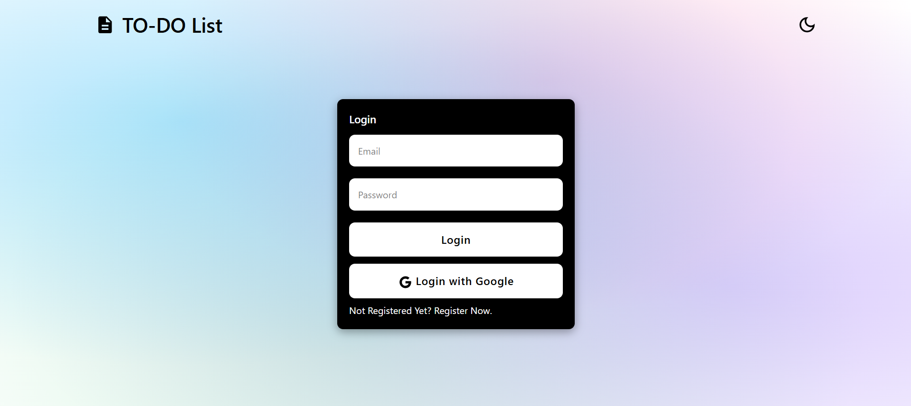
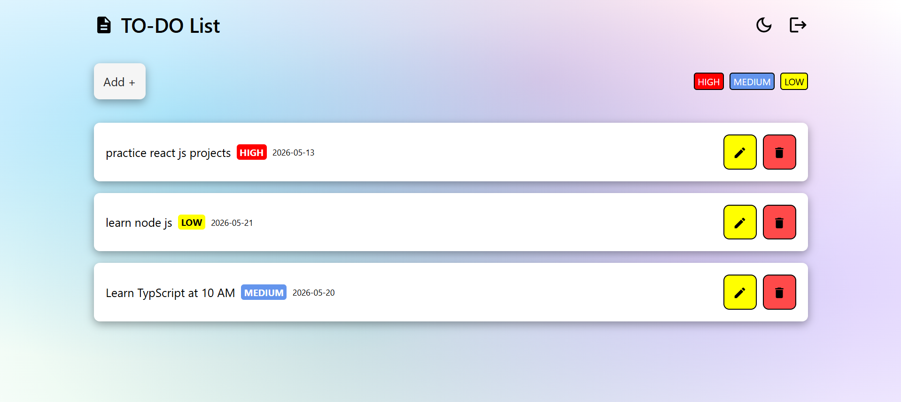
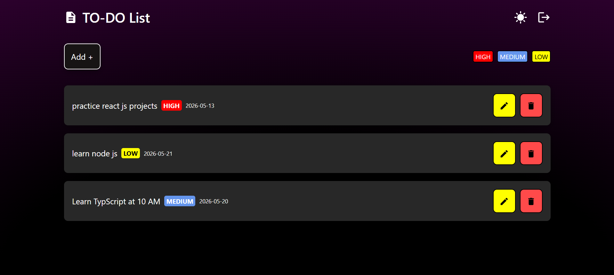
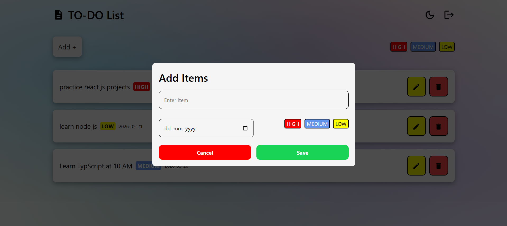

# 📝 Todo App


# 🚀 Todo App

A modern and fully responsive Todo Application built using React.js, Tailwind CSS, and Firebase.  
This project includes authentication, protected routes, CRUD functionality, dark mode, loading states, and responsive UI.

Designed and developed as a frontend/full-stack practice project for improving real-world React development skills.

## 🌐 Live Demo
🔗 https://todo-app-orcin-five.vercel.app/

---

# 🔥 Features

✅ User Authentication (Login & Register)

✅ Login with Google

✅ Protected Route for user dashboard

✅ Create, Update & Delete Tasks

✅ Firebase Authentication & Database

✅ Dark Mode Support

✅ Context API State Management

✅ Loading Spinner & Shimmer UI

✅ Responsive Design for Mobile & Desktop

✅ Clean & Modern User Interface

---

# 🛠️ Tech Stack

| Technology | Purpose |
|------------|---------|
| ⚛️ React.js | Frontend Library |
| 🎨 Tailwind CSS | Styling |
| 🔥 Firebase | Authentication & Backend |
| 🛣️ React Router DOM | Routing |
| 🧠 Context API | State Management |
| ⚡ Vite | Build Tool |
| ▲ Vercel | Deployment |

---

# 📸 Project Screenshots

## 🏠 Home/Login Page



---

## 📋 Dashboard



---

## 🌙 Dark Mode



---

## 🌙 Add New Task



---

# 📂 Folder Structure

```bash
Todo_App/
│
├── public/
│
├── src/
│   ├── assets/
│   ├── components/
│   ├── screens/Dashboard/
│   ├── utils/
│   ├── App.jsx
│   ├── main.jsx
│   └── app.css
│
├── screenshots/
├── package.json
├── vite.config.js
└── README.md
```

---

# 📱 Responsive Design

The application is optimized for:

- 💻 Desktop
- 📱 Mobile
- 📟 Tablet

---

# 🎯 Learning Outcomes

Through this project, I practiced:

- React Component Architecture
- State Management using Context API
- Firebase Authentication
- CRUD Operations using firebase sdk's
- Protected Routing
- Responsive UI Development
- Clean Folder Structure

---

# 🚀 Future Improvements

- Task Categories
- Due Date Support
- User Profile Page

---

## 📦 Repository
🔗 https://github.com/balbir1998/Todo_App

---

## 👨‍💻 Author
👤 **Balbir Singh**  
🔗 GitHub: https://github.com/balbir1998